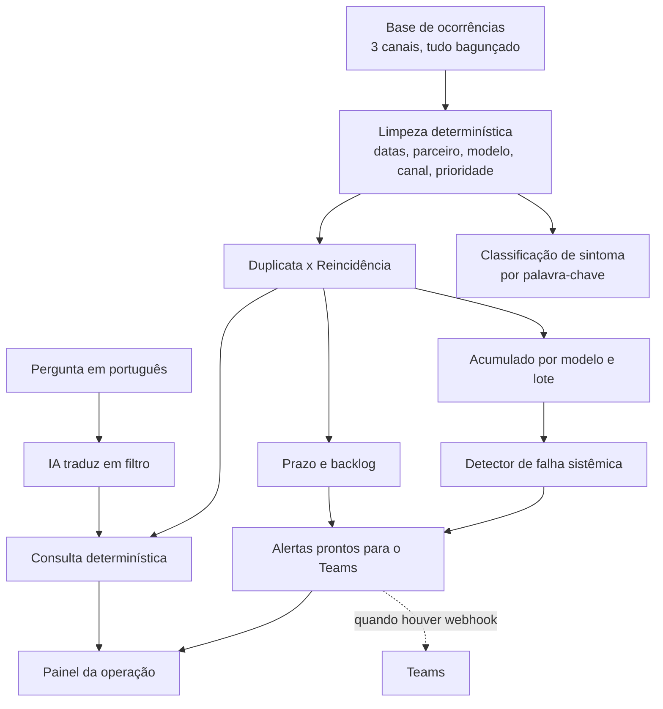

# SOLUÇÃO

## a) O gargalo que escolhi

Escolhi atacar **a falha sistêmica que ninguém enxerga a tempo**: o problema que é
do produto, não da unidade, e que hoje só aparece quando o volume já explodiu.

Foi o que a coordenação apontou como a maior dor, com todas as letras. Não é o
tempo do analista, é o fato de que ninguém olha o acumulado. O caso da linha de
lavadora que só foi percebido no terceiro mês custou caro exatamente por isso. E é
o mesmo problema que a diretoria chama de "visibilidade". Os dois lados pedem a
mesma coisa por caminhos diferentes.

A entrega é um painel que a operação abre de manhã. Ele limpa a base, junta o que
está espalhado, e mostra três coisas: os alertas do dia (prontos para o Teams), as
suspeitas de falha sistêmica olhando mês a mês, e o estado da fila. Tem também uma
caixa onde qualquer pessoa pergunta em português e recebe a resposta.

**O que deixei de fora, de propósito:**

- **Portal de abertura de chamado.** Os chamados já existem na base e chegam por
  três canais. Além disso o próprio procedimento diz que dois desses canais vão
  ser descontinuados. Construir uma quarta porta de entrada seria trabalho jogado
  fora.
- **Integração real com o Teams.** Ainda não há acesso ao workspace da empresa. Em
  vez de fingir, a mensagem já sai pronta e no tamanho certo, e o envio fica atrás
  de um adaptador que se liga quando houver o webhook. O conteúdo do alerta é o que
  importa agora; o encanamento é troca de uma função depois.
- **Reescrever o campo de sintoma na base.** Não altero o dado de origem. Classifico
  o sintoma em cima da descrição, para leitura, sem mexer no registro do parceiro.
- **Login, multiusuário, permissões por perfil.** O desafio pede uma fatia, e nada
  disso é o gargalo. Fica anotado para quando virar produto de verdade.

## b) A solução

O caminho é sempre o mesmo: limpar o dado antes de qualquer conta, marcar o que é
cópia e o que é caso novo, e então agregar. O detector de falha sistêmica olha o
volume mês a mês por modelo e por lote, e acende a luz quando o mês corrente tem
pelo menos o dobro da média dos dois meses anteriores, com um mínimo de casos para
não gritar por ruído. Duplicatas não entram nessa conta.

## c) Onde usei regra determinística, onde usei IA, e por quê

**Determinístico em quase tudo.** Foi uma decisão, não preguiça.

- **Limpeza e padronização.** Datas em quatro formatos, nomes de parceiro em
  dezenas de grafias, modelos escritos de mil jeitos. Isso é trabalho de regra, é
  auditável e não pode variar de execução para execução.
- **Duplicata x reincidência.** É lógica de tempo e canal: mesmo problema entrando
  por dois canais em poucos dias é duplicata; caso novo depois que o anterior
  fechou é reincidência. Regra explícita, testada.
- **Prazo, backlog e vencidas.** Aritmética de data.
- **Detector de falha sistêmica.** Comparação de volume entre meses. O valor está
  em olhar o acumulado, e isso não precisa de modelo de linguagem.
- **Classificação de sintoma.** Aqui eu esperava precisar de IA e não precisei. As
  descrições da base são poucas frases repetidas, então palavra-chave resolve, e
  o resultado dá para conferir a olho. Um modelo de linguagem aqui seria mais caro,
  mais lento e menos auditável.

**IA num ponto só: entender a pergunta em linguagem natural.** Quando a diretoria
pergunta "quantas geladeiras em julho no Nordeste", a IA transforma isso num filtro
estruturado. Quem conta é sempre o código, sobre o dado limpo. A IA nunca produz o
número, então ela não pode inventar. E se ela falhar ou não houver chave, um parser
determinístico assume as perguntas comuns. A IA amplia o alcance; ela não é o
alicerce.

## d) O que encontrei na base que ninguém me contou

- **O prazo da prioridade crítica se contradiz em três lugares.** O e-mail da
  coordenação fala em 24 horas, o procedimento formal fala em 48, e a base grava
  sempre 72 para as críticas, o mesmo valor da prioridade alta. Ou seja, no dado,
  "crítica" e "alta" são tratadas igual. Isso muda diretamente quais chamados
  contam como fora do prazo. Está em aberto (ver seção e).
- **A fila está muito pior do que o "tempo do analista" sugere.** Em 01/09 há 832
  ocorrências ainda abertas e a grande maioria já passou do prazo. A idade média
  das abertas passa de 90 dias. O problema não é só triar rápido, é que a fila
  cresce mais rápido do que o atendimento.
- **A coluna id_origem não liga só duplicata.** Ela também aponta o atendimento
  anterior de uma reincidência. Quem tratar id_origem como "cópia" vai apagar
  reincidências legítimas da conta. Foi um erro que eu mesmo cometi no meio do
  caminho e corrigi (ver seção h).
- **O status "Reaberta" contraria o procedimento.** O documento diz que ocorrência
  fechada não reabre, que se abre um caso novo. Mesmo assim há 72 ocorrências
  marcadas como reaberta na base.
- **O campo de sintoma é pouco confiável.** Vem em branco em quase metade dos casos
  e, quando vem, uma parte discorda da própria descrição do cliente. Por isso não
  uso esse campo como verdade: classifico pela descrição.
- **Há uma falha sistêmica escondida esperando para ser achada.** A geladeira
  GCB247SLUV vinha com poucos casos por mês e dispara em julho e agosto. E o mesmo
  modelo aparece no topo das reincidências. Uma regra simples de tendência teria
  acusado isso em julho, não no terceiro mês.
- **Sujeira que invalida contagem ingênua:** datas de fechamento anteriores à
  abertura, datas de abertura vazias, e o mesmo caso chegando por dois canais.
  Contar a base "como ela veio" dá número errado.

## e) Perguntas que eu faria à operação

1. **Qual é o prazo oficial da prioridade crítica: 24, 48 ou 72 horas?** É a
   pergunta que mais muda o resultado. O rascunho do e-mail está em
   `docs/email-alexandre.md`.
2. O que é, na prática, uma "falha sistêmica" para vocês? Existe um limiar de
   volume, ou é sempre avaliação do analista? Preciso disso para calibrar o alerta.
3. As 72 ocorrências como "Reaberta" são erro de processo ou exceção aceita? Devo
   tratá-las como caso novo ou como continuação?
4. Quando o mesmo problema chega por dois canais, qual registro é o oficial? Hoje
   eu mantenho o mais antigo e marco o outro como cópia.
5. Temos como cruzar volume de ocorrências com volume de vendas ou base instalada?
   Sem isso eu mostro quantidade, mas não consigo afirmar taxa de defeito por
   modelo.
6. Quem vai receber os alertas no Teams e quem assume a fila quando algo é
   sinalizado? O próprio dossiê diz que hoje não há uma pessoa dedicada.

## f) Como saberíamos em 30 dias que funcionou

**Métrica principal:** tempo entre o primeiro sinal de uma falha sistêmica e o
encaminhamento para a Qualidade. A referência é o caso da lavadora, que levou cerca
de três meses. A meta em 30 dias é **detectar e sinalizar em no máximo uma semana**
depois de o padrão aparecer na base.

Métrica de apoio: quantos alertas de falha sistêmica foram confirmados como reais
pela Qualidade, contra quantos foram descartados. Um detector que grita demais some
do Teams em uma semana, então o acerto do alerta importa tanto quanto a velocidade.

**O que me faria abandonar a solução:** se, depois de 30 dias, a maioria dos
alertas for descartada como ruído, ou se a Qualidade disser que nenhum deles
adiantou o que ela já não fosse perceber. Aí o detector não está agregando, e
insistir seria só barulho.

## g) Qualidade da saída de IA

A IA neste projeto faz uma coisa: traduzir a pergunta em linguagem natural num
filtro. Então o que dá para medir é se ela entende a pergunta certa.

Rotulei **20 perguntas à mão** em `eval/casos-rotulados.json`, cada uma com o filtro
que ela deveria gerar, e criei `pnpm accuracy` para rodar todas e comparar.

**Resultado medido, no modo determinístico (sem chave da OpenAI no ambiente):
18 de 20 corretas.** Os dois erros são justamente perguntas de fraseado solto:
"problema recorrente nos clientes" (um sinônimo de reincidência que a regra não
conhece) e "Pernambuco" escrito por extenso em vez da sigla. São exatamente os
casos em que a IA entra para cobrir o que a regra não pega. Com a chave presente, o
mesmo `pnpm accuracy` mede a interpretação da IA, sem trocar nada.

**Onde isso erra e como eu perceberia em produção:** o risco não é a IA contar
errado, porque ela não conta. O risco é ela escolher um filtro errado e o número
sair certo para a pergunta errada. Eu monitoraria isso registrando a pergunta e o
filtro gerado lado a lado, e revisando uma amostra por semana. Uma degradação
apareceria como aumento de perguntas caindo no filtro vazio ou no fallback.

## h) Declaração de uso de IA

**Ferramentas:** Claude Code e Codex, como par de programação, e a API da OpenAI
prevista para a busca em linguagem natural.

**Os 3 prompts mais úteis:**

1. "Leia a base inteira e me diga o que está errado, inconsistente ou surpreendente
   que ninguém me contou, sempre com número e sem inventar." Foi o que fez a análise
   sair do achismo e ir para o dado.
2. "Separe duplicata de reincidência e prove nos dados. Não trate id_origem como
   duplicata sem checar o que ela realmente liga." Foi o que revelou o vínculo
   escondido na coluna.
3. "Para cada parte, decida se é regra determinística ou IA, e defenda a escolha."
   Foi o que segurou a tentação de jogar modelo de linguagem em tudo.

**2 momentos em que a IA errou e eu corrigi:**

1. A IA tratou a coluna id_origem como duplicata de forma cega. Resultado: toda
   reincidência também era marcada como cópia e sumia das contagens. Peguei ao
   testar a pergunta "quais modelos têm mais reincidência", que voltava vazia.
   Corrigi separando os dois: reincidência tem prioridade, e o vínculo por tempo e
   canal decide o resto.
2. O classificador de linha por palavra-chave casava "ar" dentro de "lavar" e
   "aparecem", e marcava produtos como Ar-Condicionado errado. Peguei quando a
   medição de acurácia caiu. Corrigi usando limite de palavra na busca.
