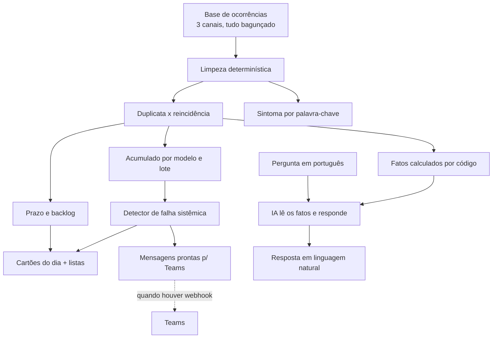

# SOLUÇÃO

## a) O gargalo que escolhi

Escolhi atacar **a falha sistêmica que ninguém enxerga a tempo**: o problema que é
do produto, e não da unidade, e que hoje só aparece quando o volume já explodiu.

Foi o que a coordenação apontou como a maior dor, com todas as letras. Não é o
tempo do analista, é o fato de que ninguém olha o acumulado. O caso da linha de
lavadora que só foi percebido no terceiro mês custou caro por isso. E é a mesma
coisa que a diretoria chama de "visibilidade". Os dois lados pedem o mesmo por
caminhos diferentes.

A entrega é uma página só. No topo, um assistente onde qualquer pessoa pergunta em
português e recebe a resposta. Abaixo, os cartões do dia: falha sistêmica suspeita,
crítico fora do prazo, fila vencida, duplicata e reincidência. Cada cartão abre a
lista por trás do número, e o de falha sistêmica e o de crítico já trazem a
mensagem pronta para o Teams, com botão de enviar.

**O que deixei de fora, de propósito:**

- **Portal de abertura de chamado.** Os chamados já existem e chegam por três
  canais, sendo que dois serão descontinuados. Uma quarta porta de entrada seria
  trabalho jogado fora.
- **Integração real com o Teams.** Não há acesso ao workspace ainda. Então a
  mensagem já sai pronta e no tamanho certo, e o envio fica atrás de um adaptador
  que se liga quando houver o webhook.
- **Login, perfis, banco de dados.** Nada disso é o gargalo. A base é lida do
  próprio arquivo, o que deixa o projeto simples de rodar.

## b) A solução

A ideia é sempre a mesma: limpar o dado antes de qualquer conta, separar cópia de
caso novo, e então agregar. O detector de falha sistêmica olha o volume mês a mês
por modelo e por lote, e acende a luz quando o mês corrente passa do dobro da média
dos dois meses anteriores, com um mínimo de casos para não gritar por ruído.
Duplicatas ficam de fora dessa conta.

## c) Onde usei regra determinística, onde usei IA, e por quê

**Determinístico em todo o núcleo.** Foi decisão, não preguiça.

- **Limpeza:** datas em quatro formatos, dezenas de grafias de parceiro, modelos
  escritos de vários jeitos. É trabalho de regra, auditável, e não pode variar de
  uma execução para outra.
- **Duplicata x reincidência, prazo, backlog, detector de falha sistêmica:** tudo é
  lógica de tempo, canal e comparação de volume. Não precisa de modelo de linguagem.
- **Classificação de sintoma:** por palavra-chave. Eu esperava precisar de IA aqui
  e não precisei, porque as descrições são poucas frases repetidas. Regra resolve e
  dá para conferir a olho.

**IA em um ponto: a conversa.** O assistente do topo usa um modelo da OpenAI para
duas coisas: entender a pergunta escrita em português e responder de forma natural,
inclusive dando recomendação quando alguém pergunta "o que devemos priorizar". Mas
todo número vem dos fatos que o código calculou. A IA recebe esses fatos prontos e
conversa em cima deles. Ela **nunca conta**, então não inventa número. Se a chave da
OpenAI faltar, o assistente cai numa resposta por regra para as perguntas comuns, e
a página continua de pé.

## d) O que encontrei na base que ninguém me contou

- **O prazo da crítica se contradiz em três lugares.** O e-mail da coordenação fala
  em 24 horas, o procedimento formal fala em 48, e a base grava sempre 72 para as
  críticas, o mesmo valor da prioridade alta. Ou seja, no dado, "crítica" e "alta"
  são tratadas igual. Isso muda diretamente o que conta como fora do prazo, então
  deixei configurável e perguntei à operação qual é o número oficial.
- **A fila está muito pior do que o "tempo do analista" sugere.** Há 832 ocorrências
  ainda abertas e a grande maioria já passou do prazo. A idade média das abertas
  passa de 90 dias.
- **A coluna id_origem não liga só duplicata.** Ela também aponta o atendimento
  anterior de uma reincidência. Tratar id_origem como cópia apaga reincidências
  legítimas da conta. Foi um erro que eu mesmo cometi e corrigi (seção h).
- **O status "Reaberta" contraria o procedimento.** O documento diz que ocorrência
  fechada não reabre. Mesmo assim há 72 registros como reaberta.
- **O campo de sintoma é pouco confiável.** Vem em branco em quase metade dos casos
  e, quando vem, uma parte discorda da descrição do cliente.
- **Há uma falha sistêmica escondida.** A geladeira GCB247SLUV vinha com poucos casos
  por mês e dispara em julho e agosto. O mesmo modelo lidera as reincidências. Uma
  regra simples de tendência acusaria isso em julho, não no terceiro mês.
- **Sujeira que estraga contagem ingênua:** datas de fechamento anteriores à
  abertura, datas de abertura vazias, e o mesmo caso chegando por dois canais.

## e) Perguntas que eu faria à operação

1. **Qual é o prazo oficial da crítica: 24, 48 ou 72 horas?** É o que mais muda o
   resultado. Rascunho do e-mail em `docs/email-alexandre.md`.
2. O que conta, na prática, como falha sistêmica? Existe um limiar de volume ou é
   sempre avaliação do analista?
3. As 72 ocorrências "Reaberta" são erro de processo ou exceção aceita?
4. Quando o mesmo problema chega por dois canais, qual registro é o oficial?
5. Dá para cruzar volume de ocorrências com vendas ou base instalada? Sem isso, eu
   mostro quantidade, mas não taxa de defeito por modelo.
6. Quem recebe os alertas no Teams e quem assume a fila quando algo é sinalizado?

## f) Como saberíamos em 30 dias que funcionou

**Métrica principal:** tempo entre o primeiro sinal de uma falha sistêmica na base e
o encaminhamento para a Qualidade. A referência é o caso da lavadora, que levou
cerca de três meses. A meta em 30 dias é **detectar e sinalizar em até uma semana**
depois de o padrão aparecer.

Métrica de apoio: quantos alertas de falha sistêmica a Qualidade confirmou como
reais, contra quantos descartou. Um detector que grita demais some do Teams em uma
semana.

**O que me faria abandonar:** se a maioria dos alertas for descartada como ruído, ou
se a Qualidade disser que nenhum adiantou o que ela já não fosse perceber. Aí o
detector não agrega, e insistir seria só barulho.

## g) Qualidade da saída de IA

A IA faz duas coisas na conversa: entende a pergunta e escreve a resposta. O número
em si sempre vem do código, dos fatos calculados. Então o que dá para medir de
verdade é se a pergunta foi entendida certo.

Rotulei **20 perguntas à mão** em `eval/casos-rotulados.json`, cada uma com o
resultado que ela deveria produzir, e criei `pnpm accuracy` para rodar todas e
comparar.

**Resultado medido: 18 de 20 corretas.** Os dois erros são de fraseado solto:
"problema recorrente nos clientes" (um sinônimo de reincidência que a regra não
conhece) e "Pernambuco" escrito por extenso em vez da sigla. São justamente os casos
em que o modelo de linguagem ajuda a entender, e por isso ele está na conversa.

**Onde erra e como eu perceberia em produção:** o risco não é a IA contar errado,
porque ela não conta. O risco é ela entender a pergunta errada e responder com
firmeza mesmo assim. Eu monitoraria isso guardando a pergunta e a resposta lado a
lado e revisando uma amostra por semana. Uma piora apareceria como aumento de
perguntas sem resposta clara ou respondidas fora do que foi pedido.

## h) Declaração de uso de IA

**Ferramentas:** Claude Code e Codex como par de programação, e a API da OpenAI
(modelo gpt-4o-mini) para o assistente da página.

**Os 3 prompts mais úteis:**

1. "Leia a base inteira e me diga o que está errado, inconsistente ou surpreendente
   que ninguém me contou, sempre com número e sem inventar." Tirou a análise do
   achismo.
2. "Separe duplicata de reincidência e prove nos dados. Não trate id_origem como
   duplicata sem checar o que ela realmente liga." Revelou o vínculo escondido na
   coluna.
3. "Para cada parte, decida se é regra determinística ou IA, e defenda a escolha."
   Segurou a tentação de jogar modelo de linguagem em tudo.

**2 momentos em que a IA errou e eu corrigi:**

1. A IA tratou a coluna id_origem como duplicata de forma cega. Resultado: toda
   reincidência também era marcada como cópia e sumia das contagens. Peguei ao testar
   a pergunta de reincidência, que voltava vazia. Corrigi separando os dois:
   reincidência tem prioridade, e o vínculo por tempo e canal decide o resto.
2. O classificador de linha por palavra-chave casava "ar" dentro de "lavar" e
   "aparecem", marcando o produto como Ar-Condicionado errado. Peguei quando a
   medição de acurácia caiu, e corrigi usando limite de palavra na busca.
